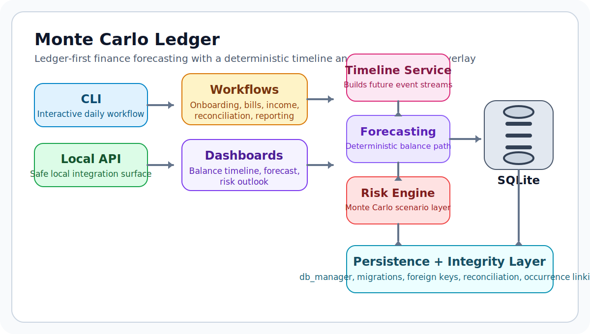

# Monte Carlo Ledger

Monte Carlo Ledger is a local-first finance project focused on a more useful question than
"what is my current balance?":

> How much can I safely spend before my next paycheck, and how likely is that answer to hold up?

The project combines a ledger-first SQLite core, a deterministic cash-flow timeline, and a bounded
Monte Carlo risk model. The result is a CLI and local API that feel practical to use while still
reading like an intentional engineering project instead of a themed CRUD app.



## At a Glance

- **Problem**: most budget tools show balances, but not cash-flow fragility.
- **Approach**: model future income and bills on a real timeline, then stress-test that forecast.
- **Surfaces**: local CLI for day-to-day use and a local-only FastAPI surface for integrations.
- **Engineering focus**: integrity-first persistence, explicit migrations, package boundaries,
  typed/linted quality gates, and regression coverage.

## Why It Stands Out

- **Ledger-first accounting**: balance is derived from transactions, not treated as an editable
  source of truth.
- **Deterministic forecast first**: recurring bills and income are merged into a real future
  timeline before simulation happens.
- **Probabilistic stress test second**: the Monte Carlo layer measures how robust that forecast is
  under bounded variance.
- **Local-first by design**: SQLite, no hosted dependencies, and a deliberately local-only API
  surface.
- **Engineering discipline**: package layout, schema migrations, foreign-key enforcement,
  regression tests, Ruff, Pyright, and CI.

## What You Can Do With It

- Record income, bills, and reconciliation adjustments in a ledger-backed system.
- Forecast the next 90 days of balance changes from scheduled obligations and income.
- Calculate a "safe to spend" number from the lowest projected balance point.
- Run Monte Carlo scenarios to see how income variance and surprise expenses affect that answer.
- Inspect the same logic through a local API without exposing financial data to a hosted service.

## Why This Project Is Interesting To Review

- It is not just a budgeting wrapper around a database. The repo has an actual forecasting model,
  risk layer, and persistence integrity story.
- It shows the difference between product logic and toy math: deterministic baseline first,
  stochastic overlay second.
- It treats trust as a feature. Integer cents, ledger reconciliation, and foreign-key enforcement
  are all explicit design decisions, not accidental implementation details.

## Quick Start

### Requirements

- Python 3.10+
- SQLite 3.25.0+

### Install

```bash
git clone <repo-url>
cd MonteCarlo-Ledger
pip install -e .
```

For development:

```bash
pip install -e .[dev]
```

### Run the CLI

```bash
python -m monte_carlo_ledger
```

Legacy compatibility entry point:

```bash
python main.py
```

On first run, the app walks through onboarding and stores data in `ledger.db` at the repo root.

### Run the API

This API is intentionally local-only. It has no authentication and should not be exposed publicly.

```bash
python -m uvicorn monte_carlo_ledger.api:app --reload --host 127.0.0.1 --port 8000
```

Legacy compatibility entry point:

```bash
python -m uvicorn api:app --reload --host 127.0.0.1 --port 8000
```

### Example Endpoint

`GET /safe-to-spend?days_ahead=30`

Example response:

```json
{
  "safe_spend_cents": 45200,
  "days_ahead": 30
}
```

If the cached balance and ledger diverge, the API returns `409 Conflict` instead of serving a
potentially misleading number.

## Example Scenario

Imagine this setup:

- paycheck every two weeks
- rent due on the 1st
- utilities and phone due mid-month
- a few expected but irregular expenses

Monte Carlo Ledger builds the upcoming timeline, projects the balance path, finds the lowest point
before the next income event, and then asks a second question: "what if reality is a little worse
than the plan?" That is the point of the Monte Carlo layer.

## Quality Gates

```bash
python -m pytest -q
python -m ruff check .
python -m pyright
```

These checks also run in GitHub Actions.

## Project Layout

```text
. 
├── README.md
├── pyproject.toml
├── LICENSE
├── monte_carlo_ledger/
│   ├── cli.py
│   ├── api.py
│   ├── ui.py
│   ├── dashboards.py
│   ├── workflows.py
│   ├── workflow_onboarding.py
│   ├── workflow_payments.py
│   ├── workflow_income.py
│   ├── workflow_account.py
│   ├── workflow_reporting.py
│   ├── forecasting.py
│   ├── risk.py
│   ├── timeline_service.py
│   ├── db_manager.py
│   ├── budget_engine.py
│   ├── domain_rules.py
│   ├── monte_carlo_config.py
│   └── schema.sql
├── docs/
│   ├── ARCHITECTURE.md
│   ├── engineering-walkthrough.md
│   ├── upgrade-plan.md
│   └── assets/
├── tests/
└── scripts/
```

`workflows.py` now acts as a stable facade over smaller domain-specific workflow modules, and
legacy root-level modules remain as compatibility shims so existing tests and scripts keep working.

## Engineering Decisions

- **Integer cents only**: no floats in persisted or core monetary logic.
- **Ledger is authoritative**: stored balance is cached, reconciled, and never trusted blindly.
- **Foreign keys are enforced**: payment deletion no longer leaves orphaned bill occurrences behind.
- **Deterministic before probabilistic**: the Monte Carlo engine sits on top of a real event timeline.
- **Property-based invariants**: Hypothesis tests probe money parsing and recurrence logic across broad input ranges.

## Documentation

- [Architecture](./docs/ARCHITECTURE.md)
- [Engineering Walkthrough](./docs/engineering-walkthrough.md)
- [Upgrade Plan](./docs/upgrade-plan.md)

## Presentation Notes

The public-facing story is strongest when this repo is treated as:

- a forecasting and risk-analysis project for personal finance
- a ledger-integrity project with real persistence constraints
- a small but deliberate systems codebase, not just a CLI utility

## License

MIT. See [LICENSE](./LICENSE).
